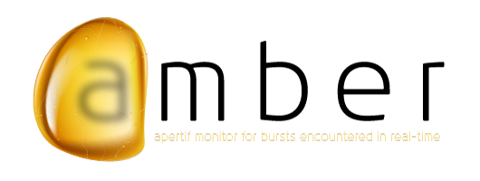

# AMBER: a Fast Radio Burst real-time pipeline

AMBER is a many-core accelerated and fully auto-tuned pipeline for detecting Fast Radio Bursts and other single pulse radio transients.

## Installation

The easiest way to install AMBER is by using the [AMBER_setup](https://github.com/TRASAL/AMBER_setup) script.

## Publications

* Alessio Sclocco, Stijn Heldens, Ben van Werkhoven. _AMBER: A real-time pipeline for the detection of single pulse astronomical transients_. **SoftwareX**, 2020. ([print](https://doi.org/10.1016/j.softx.2020.100549))
* Alessio Sclocco, Joeri van Leeuwen, Henri E. Bal, Rob V. van Nieuwpoort. _A Real-Time Radio Transient Pipeline for ARTS_. **3rd IEEE Global Conference on Signal & Information Processing**, December 14-16, 2015, Orlando (Florida), USA. ([print](http://ieeexplore.ieee.org/xpl/freeabs_all.jsp?arnumber=7418239&abstractAccess=no&userType=inst)) ([preprint](http://alessio.sclocco.eu/pubs/sclocco2015a.pdf)) ([slides](http://alessio.sclocco.eu/pubs/Presentation_GlobalSIP2015.pdf))

## Dependencies

* [Google Test](https://github.com/google/googletest)
* [utils](https://github.com/isazi/utils)
* [OpenCL](https://github.com/isazi/OpenCL)
* [AstroData](https://github.com/TRASAL/AstroData)
* [Dedispersion](https://github.com/TRASAL/Dedispersion)
* [Integration](https://github.com/TRASAL/Integration)
* [SNR](https://github.com/TRASAL/SNR)
* [RFIm](https://github.com/TRASAL/RFIm)

## License

Licensed under the Apache License, Version 2.0.

